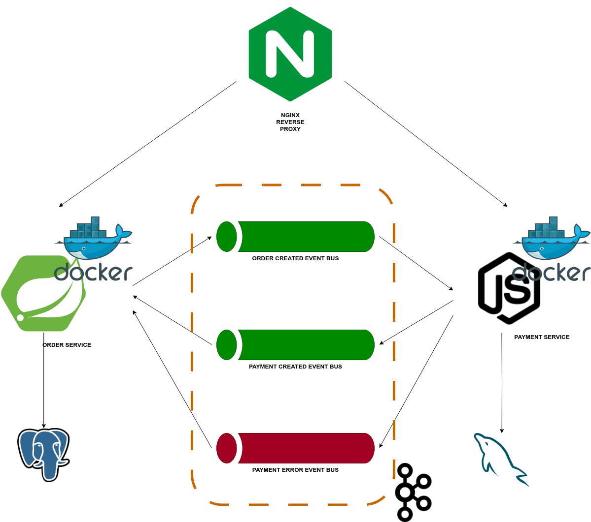

# microservicios-saga-coreografia


## Stack

- SpringBoot 3.1.2
- JDK17
- Maven
- Postgres 14.1
- NodeJs 18.17.1
- NPM 9.6.7
- Express 4.18.2
- MySQL 8.0
- Kafka
- Docker | Docker Compose
- NGINX


## Build

```shell
mvn clean install
```

## Run

```shell
docker-compose -f docker-compose.yaml -p microservicios-saga-coreografia up -d --build
``` 

## Arquitectura
